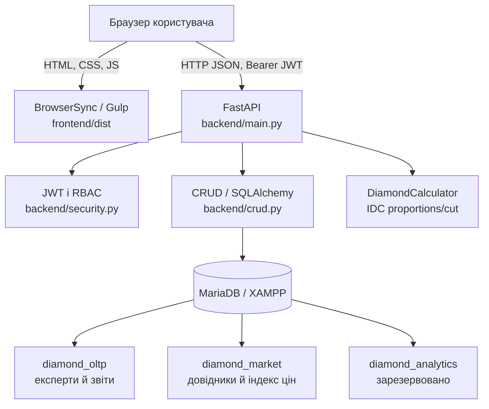

# 🏗️ Архітектура застосунку «Diamant ID»

Цей документ описує фактичну високорівневу архітектуру дипломного проєкту «Diamant ID»: локальної системи для ведення звітів про діаманти, довідників оцінювання, системного IDC-розрахунку та versioned ринкових довідкових орієнтирів.

Документ відображає код у репозиторії, а не лише початковий задум. Стан локального запуску наведено в [local-start.md](./local-start.md), детальна карта таблиць і зв’язків — у [db-schema.md](./db-schema.md), повний користувацький workflow звіту й паспорта — у [guide](./guides/current-domain-and-report-workflow.md), а окрема механіка market provider-ів — у [guide провайдерів](./guides/market-data-providers.md). Перелік виконаного й запланованого — у [work_plan.md](./work_plan.md), журнал змін — у [progress.md](./progress.md).

> **Статус на 25 вересня 2026.** Працює локальний контур: frontend на Pug/SCSS/JavaScript збирається Gulp і віддається BrowserSync; FastAPI надає JSON API та JWT-вхід; SQLAlchemy працює з MariaDB у XAMPP. Кодова й локальна MariaDB head — `0015_multi_provider_market_references`. `0013` додає керований зовнішнім scheduler-ом контур OpenFacet/НБУ, `0014` — schema-only server-enforced ізоляцію synthetic demo dataset, а `0015` нормалізує future-only market policy: enabled providers і nullable dashboard primary без переписування reports, valuations чи подій. Dashboard, wizard і private detail/edit використовують лише operational `/reports`; legacy `/diamonds/*` і небезпечний `recalc_grades.py` вилучено без міграції historical projection-колонок. Public passport має окремий allow-listed endpoint для явно погоджених admin-ом JPEG/PNG/WebP фото каменю та plotting; storage ніколи не монтується статично. Docker, PostgreSQL і завершений ML-потік ще не реалізовані.

---

## 1. Загальна концепція

Система має три прикладні шари з розподіленою відповідальністю.

1. **Клієнтський шар (Frontend).** Статичний інтерфейс на Pug, SCSS і vanilla JavaScript. Він показує сторінки, зберігає JWT у `localStorage` та викликає HTTP API.
2. **Серверний шар (Backend/API).** FastAPI маршрути виконують автентифікацію, перевіряють ролі, валідують запити Pydantic-схемами й координують доступ до даних та доменні розрахунки.
3. **Шар даних і доменних сервісів.** SQLAlchemy-моделі зберігають експертів, звіти й ринкові довідники в MariaDB. IDC-калькулятор визначає оцінки пропорцій та огранювання; майбутній ML-контур ще не реалізований.

### Схема взаємодії компонентів



---

## 2. Локальне середовище розробки

Поточний підтримуваний runtime — **Windows, Python virtual environment, XAMPP MariaDB і Node.js**. Apache у XAMPP не потрібен для FastAPI/Gulp контуру; потрібен сервіс MySQL/MariaDB.

| Компонент | Поточна роль | Типовий локальний доступ |
| --- | --- | --- |
| MariaDB / XAMPP | Три бази даних, seed-дані | `localhost:3306` |
| FastAPI + Uvicorn | JSON API, Swagger, JWT | `http://127.0.0.1:8000` |
| Gulp + BrowserSync | Збірка та віддавання frontend | `http://localhost:3000` або інший вільний порт |

Backend запускають із кореня репозиторію через `python -m uvicorn backend.main:app --reload`; frontend — командами `npm run build` або `npm start` із папки `frontend`. Повні, перевірені команди є в [local-start.md](./local-start.md).

`scripts/bootstrap_mariadb_databases.py` безпечно створює лише відсутні локальні databases. `alembic/` містить версіоновану структуру таблиць. `scripts/seed_db.py` — **руйнівний локальний seed**: він перестворює `diamond_oltp`, `diamond_market` і `diamond_analytics`, застосовує `alembic upgrade head`, а потім наповнює довідники, експертів і звіти з `data/diamonds_dataset.csv`. Його не можна запускати проти цінних даних або майбутнього production-середовища.

---

## 3. Структура папок проєкту

```plaintext
/
├── backend/                         # FastAPI-застосунок
│   ├── main.py                      # Маршрути, dependencies, CORS і RBAC-перевірки
│   ├── database.py                  # Engine і сесії SQLAlchemy для MariaDB
│   ├── models.py                    # SQLAlchemy-моделі трьох логічних БД
│   ├── schemas.py                   # Pydantic-контракти API
│   ├── crud.py                      # Операції читання й запису
│   ├── calculator.py                # Правила IDC для proportions і cut
│   └── security.py                  # JWT і хешування паролів
├── frontend/
│   ├── src/
│   │   ├── pug/                     # Layout і сторінки інтерфейсу
│   │   ├── scss/                    # Стилі та дизайн-токени
│   │   └── js/                      # Клієнтська логіка, API і auth-модулі
│   ├── dist/                        # Згенерований Gulp результат, не редагується вручну
│   ├── gulpfile.js                  # Pug/SCSS/JS/images pipeline і BrowserSync
│   └── package.json                 # Команди frontend та API-аудиту
├── scripts/
│   ├── bootstrap_mariadb_databases.py # Створення відсутніх локальних databases
│   ├── seed_db.py                   # Перестворення й наповнення локальних БД
│   └── audit-api.mjs                # Безпечний локальний API contract/smoke audit
├── data/                            # CSV-набір для локального seed
├── storage/                         # Gitignored приватні файли звітів (runtime)
├── alembic/                         # Версіоновані зміни MariaDB-схеми
├── alembic.ini                      # Конфігурація Alembic
├── docs/                            # Runbook, план робіт, прогрес і архітектура
├── .codex/                          # Правила й локальні навички агента
├── AGENTS.md                        # Робочі інструкції для агентів
├── requirements.txt                 # Python-залежності
└── .env                             # Приватна локальна конфігурація, не комітується
```

---

## 4. Backend і API

`backend/main.py` є точкою входу застосунку. Він створює FastAPI, налаштовує CORS для локальних адрес `localhost` і `127.0.0.1` з довільним портом та оголошує маршрути.

### Автентифікація й ролі

- `POST /token` приймає form-data логін і пароль та повертає JWT Bearer token.
- `get_current_user` перевіряє JWT і завантажує користувача з БД.
- Роль `admin` потрібна для керування користувачами й оновлення ринкової ціни; роль `gemologist` призначена для роботи зі звітами.
- Frontend передає токен у `Authorization: Bearer …`; API доступний на окремому локальному origin через CORS.

Поточний seed вимагає приватні `SEED_*_PASSWORD` змінні й зберігає лише bcrypt-хеші; `SECRET_KEY` також є обов’язковою конфігурацією. Це захищає локальний MVP від історичної перевірки паролів у відкритому вигляді, але не замінює майбутній production security review.

### Предметні маршрути

| Група | Призначення |
| --- | --- |
| `/reports`, `/report-wizard-sessions` | Приватний API ядра: draft, stone, lifecycle, події, RBAC, server-paginated dashboard list і full detail/update. `PUT /reports/{id}` допускається тільки для draft owner/admin та створює append-only `report_updated`; transitions лишаються окремим endpoint-ом. `POST /reports/{id}/work-session` приймає лише owner-gemologist draft та server-time start/resume/heartbeat/pause/save; один lease на report/owner не дозволяє двом вкладкам подвоїти active-time. `POST /report-wizard-sessions` створює лише короткоживучий pre-save lease; успішний `POST /reports` атомарно перетворює його на `time_to_first_save_seconds`, а покинуті або replaced/offline майстри не потрапляють в operational metrics. Dashboard передає `sold=true|false`; це зручна двостанова проєкція фактичного `market_status` (`sold` / усі інші стани), а не втрата його деталізації. Для локального demo-набору список також повертає legacy `price`, який UI маркує `USD … d`; це не ринкова чи експертна ціна. Підтримуваний draft best-effort отримує окремий `system_market_reference` з останнього approved snapshot-а кожного enabled policy provider-а; dashboard primary не змінює збережені значення, а ручний запис має пріоритет тільки у межах того самого provider-а. |
| `/reports/{report_id}/media` | Приватні upload, список, читання й видалення вкладень owner/admin; без public serving. |
| `/reports/{report_id}/passport` | Admin-only publication state, publish/reissue/revoke, SVG QR та on-demand PDF-паспорт для поточного public URL. GET повертає `200` з `passport: null`, коли паспорт ще не опубліковано: це нормальний private UI-стан, а не помилка. PDF будується з тієї самої allow-listed проєкції, додає лише чинні SHA-256-перевірені `stone_photo`/`plotting_diagram`, не зберігається як snapshot і недоступний після revoke/void. |
| `/public/passports/{public_id}` | Анонімна allow-listed projection лише активного `issued` report; 404 не розрізняє відсутній, відкликаний або недоступний token. |
| `/reference-values` | Авторизоване читання текстових серверних довідників нового контракту. |
| `/users/`, `/users/me`, `/users/me/profile`, `/users/me/password`, `/users/{id}/activate`, `/users/{id}/deactivate`, `/experts/` | Admin керує ролями й оборотним active-станом; користувач змінює лише власні ПІБ/пароль. Inactive account не проходить login/JWT; останній active admin захищений. |
| `/market/mappings`, `/market/price` | Compatibility-маршрути для legacy mappings і технічного demo-індексу. Вони не є авторитетним ринковим джерелом і не створюють фінансової оцінки. |
| `/market-data/*`, `/reports/{report_id}/valuations*` | Admin-only provider-neutral контур: каталог provider-ів, future-only enabled set і nullable dashboard primary, OpenFacet candidate → approve/reject, НБУ USD/UAH, графіки/пороги freshness та append-only журнал операцій. Зовнішній scheduler запускає CLI, а save report ніколи не fetch-ить provider: для кожного enabled provider він незалежно бере вже approved snapshot; непридатний provider просто не створює свого valuation. Значення не усереднюються й не є fallback одне одному. Dashboard показує лише primary та `+N`, private UI — всі provider-specific записи. Кожен valuation має immutable provenance і окрему append-only подію; public passport і PDF сюди не підключені. |
| `/demo/datasets/{dataset_id}` | Явний admin-only read-only контур одного manifest-authorized synthetic dataset, включно з detail та private `passport-preview/pdf`. Звичайні `/reports`, operational analytics і public passport/PDF/QR не бачать demo; gemologist отримує opaque `404`. Лише showcase `DEMO-00999` має `DEMO · INTERNAL PREVIEW` PDF із bundled synthetic photo/plotting assets; усі demo PDF не мають `public_passports`, public ID, URL, QR або anonymous media endpoint. `scripts/generate_synthetic_demo_dataset.py` готує лише `synthetic-demo-v2`: pure preview не торкається БД, `--dry-run-replace-v1` читає v1-owned залежності, а `--replace-v1 --confirm-replace-v1` виконує контрольовану транзакційну заміну після backup/restore verification. Loader створює лише `DEMO-…`/`demo` rows, один checksum manifest та system-origin `NULL` actor-поля; не викликає provider-ів і не змінює operational data. Майбутня demo-аналітика зобов'язана перевірити manifest `provenance` і `analysis_eligibility`, а не ID-prefix. |
| `/statistics/expert-performance`, `/statistics/admin-review-performance` | Admin-only operational analytics. Необов’язкові `date_from`/`date_to` застосовуються відповідно до `DiamondReport.created_at` для status counts, завершення server-timed session для active-time та часу рішення admin для review-cycle. Поточна review-черга не є історично реконструйованою. Немає ціни, ML чи рейтингу. |
| `/docs`, `/openapi.json` | Swagger UI та машинозчитуваний API-контракт FastAPI. |

Поточний контракт без зміни даних перевіряє `scripts/audit-api.mjs`. Скрипт приймає лише локальний HTTP API, виконує GET-запити й CORS preflight та зберігає ігноровані Git звіти у `docs/audits/`.

---

## 5. Дані та доменна логіка

Один SQLAlchemy engine підключається до MariaDB, а моделі вказують логічну схему (MariaDB database) через `__table_args__`.

| База | Призначення | Поточний стан |
| --- | --- | --- |
| `diamond_oltp` | `experts` (з `is_active`), compatibility `diamond_reports` з `record_scope`/nullable `demo_dataset_id`, immutable `demo_datasets`, `stones`, `report_events`, `report_work_sessions`, append-only `report_work_session_events`, single-tab `report_work_session_leases`, короткоживучі `wizard_work_sessions`, `public_passports`, `grading_rulesets`, `stone_valuations`, `media_assets` і lifecycle-колонки | Кодова й локальна MariaDB head — `0015_multi_provider_market_references`; classification historical seed не виконано |
| `diamond_market` | `grade_mappings`, legacy demo-індекс, `reference_values`, provider catalog, versioned market snapshots/quotes, immutable FX snapshots і normalized future-only market policy | `0015` додає enabled provider rows та nullable primary; без backfill |
| `diamond_analytics` | Зарезервована `ml_results` для майбутніх ML-результатів | SQLAlchemy-модель і чистий seed реалізовано; таблиця порожня, API, модель і ML-потік відсутні |

Новий wizard створює звіт через `POST /reports`: сервер призначає остаточний
`report_id`, зберігає окрему `examination_date` і встановлює
`market_status=not_for_sale`. `GET /reports/next-id` лише показує наступний
номер без резервування, а `POST /reports/preview` повертає розрахункові IDC
grades і, коли є застосовний approved snapshot enabled policy provider-а,
окремий нефіксований системний USD-орієнтир для кожного provider-а. Preview не є `price`, не створює
`StoneValuation` та не отримує НБУ.

Wizard не викликає ML-модель: його preview не записує ціну. Під час збереження
draft `StoneValuation` може отримати автоматичний policy-орієнтир, але не старий
`price`. Admin може
прикріпити лише approved market snapshot, який зберігає провайдера, джерело,
методологію, checksum, USD/ct quotes і момент отримання. Для OpenFacet
потрібне явне підтвердження застосовності до конкретного natural-звіту,
оскільки поточний контракт не зберігає дані лабораторного сертифіката. Це
довідковий benchmark, не експертна, продажна чи транзакційна ціна. Під час
його прикріплення backend не використовує старий курс: він запитує офіційний
USD/UAH НБУ, а потім зберігає Decimal rate, official rate date, UAH total і
FX snapshot. Якщо НБУ недоступний, valuation не створюється; пізніші курси не
змінюють уже збережені суми. Деталі — у
[ADR-002](./decisions/002-financial-calculation-contract.md).

### Межа IDC, historical projections і майбутнього ML

`DiamondCalculator` — детермінований, спрощений системний розрахунок для
поточної версії ruleset. Він не є IDC-сертифікацією, ML-моделлю, експертним
підтвердженням або джерелом ринкової ціни. System grades фіксуються в report
разом із `calculation_rule_version`; expert-confirmed grades залишаються
окремими даними експерта.

Legacy-колонки `DiamondReport` збережені лише як compatibility/historical
projection. Старий скрипт, який масово переписував їх без dry-run, scope,
audit trail чи rollback plan, вилучено. Жоден чинний endpoint не перераховує
виданий або historical report. Нова IDC-методика має отримати новий ruleset і
застосовуватись forward-only; read-only порівняння або будь-який write-flow
можливі лише окремою погодженою задачею. Повна політика — в
[ADR-004](./decisions/004-legacy-calculation-and-ml-boundary.md).

`diamond_analytics.ml_results` не є контрактом готової аналітики: вона не
містить даних і не має API. До появи ML чи карт Кохонена потрібні ліцензований
dataset, versioned training/model artifact, відтворювана валідація, provenance
кожного результату та правила його неавторитетного відображення. OpenFacet і
потенційний IDEX — runtime market-reference providers, а не training data без
окремого письмового дозволу. SOM є descriptive segmentation, не інвестиційним
verdict. Повна межа зафіксована в [ADR-005](./decisions/005-analytics-and-verified-ml-strategy.md).
ML не може переписувати system/expert grades, lifecycle або ринкові орієнтири.

Active-time не береться з `created_at`, `updated_at`, legacy
`evaluation_time_sec` чи review-cycle. Після першого save owner-gemologist у
редакторі draft запускає сесію тільки дією у видимій вкладці. Сервер приймає
час за власним годинником, зараховує не більше 60 секунд між сигналами й
закриває lease після 75 секунд. Прихована/offline вкладка не додає час;
паралельна вкладка замінює попередню сесію. Перехід `draft → review` закриває
активну сесію server-side. Це operational metric, не оцінка продуктивності.

---

## 6. Frontend

До першого явного save wizard зберігає лише serializable поля й активний крок у
versioned `sessionStorage` ключі поточного user ID. Відновлення завжди потребує
вибору користувача; file inputs, JWT і будь-які credentials не серіалізуються,
а browser не створює приховану server-side чернетку. Внутрішня навігація з
таким станом проходить через project dialog; refresh і закриття вкладки
використовують невласний `beforeunload` browser warning.

Gulp перетворює Pug на HTML, SCSS на CSS, копіює JavaScript та зображення у `frontend/dist`. BrowserSync віддає `dist` як статичний сайт і стежить за файлами `frontend/src`. `ghostMode: false` навмисно вимикає дзеркалення кліків і вводу між кількома локальними вікнами, щоб action виконувався лише там, де його натиснули. Спискові та read-only екрани синхронізують дані з API після повернення вкладки у фокус і кожні 30 секунд, коли вкладка видима: dashboard, private detail поза режимом редагування, admin directory, довідники та public passport. Форми з незбереженим вводом (wizard, profile, detail edit) автоматично не перезаписуються.

Клієнтський JavaScript містить базовий API-клієнт із локальним default `127.0.0.1:8000`, модуль входу, доступний перемикач видимості для кожного password input та сторінкову логіку для landing, login, dashboard і створення звіту. Лише ізольований real E2E перед завантаженням сторінки задає `globalThis.DIAMANT_API_BASE_URL` для власного API на іншому порту; операторський runtime цього не використовує. Це окремий frontend без SSR, React чи TypeScript. Адреса API та зберігання токена потребують окремої конфігурації перед розгортанням на домені.

---

## 7. Середовища, гілки й майбутнє розгортання

| Контур | База даних | Статус |
| --- | --- | --- |
| `local-dev` | MariaDB / XAMPP | Поточна підтримувана розробка |
| `main` | PostgreSQL | Майбутній deploy-кандидат, ще не налаштований |

Відмінності середовищ мають задаватися конфігурацією, драйвером і версіонованими міграціями, а не умовами на назву Git-гілки. До окремого етапу міграції MariaDB залишається єдиною підтримуваною runtime-БД.

Планований PostgreSQL-контур потребує: явного `DATABASE_URL`, Alembic-міграцій, безпечного seed/backfill, звірки даних, rollback-плану, Dockerfile та deployment-конфігурації. Вибір провайдера backend і схема розгортання frontend на shared hosting не вважаються реалізованими.

---

## 8. Межі поточної реалізації

- Є базовий test-контур: pytest unit/API/integration працює з SQLite у пам’яті, Node тестує auth/API-модулі та jsdom, а `npm run test:e2e` перевіряє mock browser flows. Окремий `npm run test:e2e:real` використовує disposable file SQLite із schema translation, test accounts і private storage; він виконує login → dashboard → wizard → draft/edit → review → issued → public passport/PDF без доступу до MariaDB. Це не замінює окремої перевірки MariaDB/PostgreSQL-сумісності перед staging.
- Private dashboard → створення → detail/edit має mock Playwright і один ізольований real browser flow. Робочі облікові записи та локальна MariaDB не використовуються у Playwright.
- Моделі, seed і CRUD мають бути звірені перед PostgreSQL-міграцією; зокрема `diamond_analytics` ще не має реалізованого аналітичного шару.
- Поточні JWT, CORS, зберігання токена й seed-облікові дані придатні лише для локального MVP та мають пройти security hardening до публічного домену.

Детальний порядок цих робіт підтримується у [work_plan.md](./work_plan.md); архітектурні рішення та зміни структури потрібно відображати в цьому документі й у [progress.md](./progress.md).
