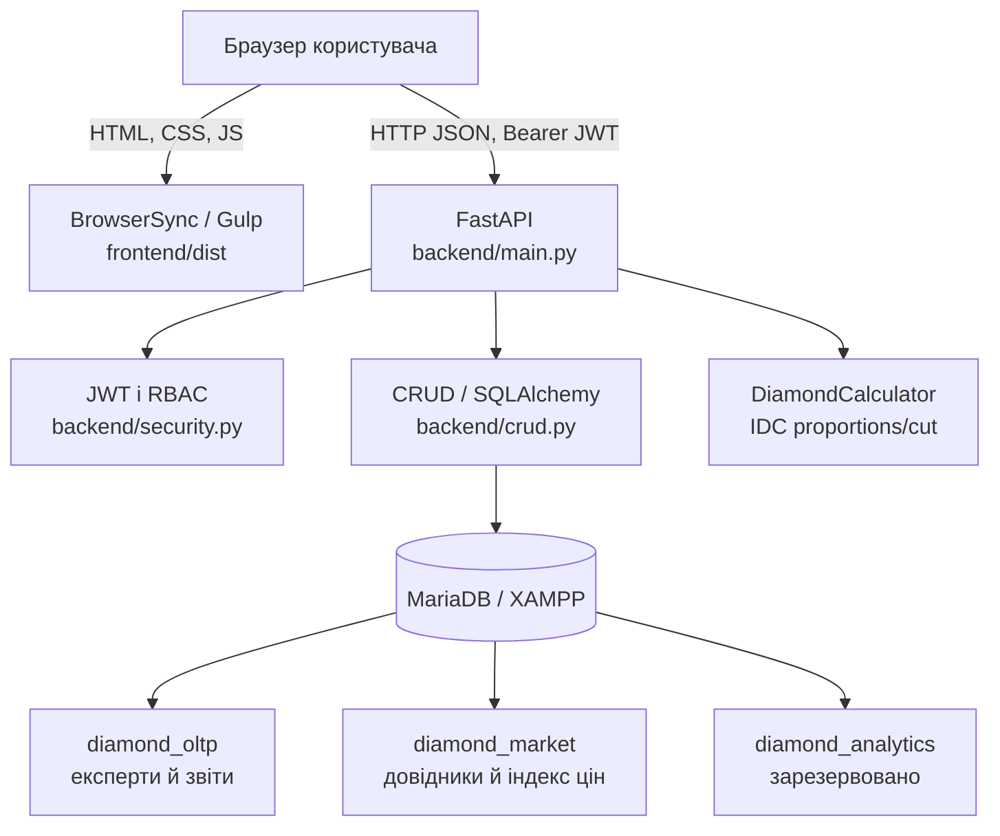

# 🏗️ Архітектура застосунку «Diamant ID»

Цей документ описує фактичну високорівневу архітектуру дипломного проєкту «Diamant ID»: локальної системи для ведення звітів про діаманти, довідників оцінювання, розрахунку IDC-параметрів і демонстраційного прогнозу ціни.

Документ відображає код у репозиторії, а не лише початковий задум. Стан локального запуску наведено в [local-start.md](./local-start.md), детальна карта таблиць і зв’язків — у [db-schema.md](./db-schema.md), повний користувацький workflow звіту й паспорта — у [guide](./guides/current-domain-and-report-workflow.md), перелік виконаного й запланованого — у [work_plan.md](./work_plan.md), журнал змін — у [progress.md](./progress.md).

> **Статус на 17 вересня 2026.** Працює локальний контур: frontend на Pug/SCSS/JavaScript збирається Gulp і віддається BrowserSync; FastAPI надає JSON API та JWT-вхід; SQLAlchemy працює з MariaDB у XAMPP. Revisions `0002_report_core`–`0007_grading_rulesets` формують ядро, private files, authoring-вимоги, revocable public passport і immutable metadata ruleset-ів. `0007` застосовано до локальної MariaDB 17 вересня 2026. Dashboard, wizard і private detail/edit використовують лише `/reports`; legacy `/diamonds/*` вилучено без міграції historical колонок. Docker, PostgreSQL і завершений ML-потік ще не реалізовані.

---

## 1. Загальна концепція

Система має три прикладні шари з розподіленою відповідальністю.

1. **Клієнтський шар (Frontend).** Статичний інтерфейс на Pug, SCSS і vanilla JavaScript. Він показує сторінки, зберігає JWT у `localStorage` та викликає HTTP API.
2. **Серверний шар (Backend/API).** FastAPI маршрути виконують автентифікацію, перевіряють ролі, валідують запити Pydantic-схемами й координують доступ до даних та доменні розрахунки.
3. **Шар даних і доменних сервісів.** SQLAlchemy-моделі зберігають експертів, звіти й ринкові довідники в MariaDB. IDC-калькулятор визначає оцінки пропорцій та огранювання; майбутній ML-контур ще не реалізований.

### Схема взаємодії компонентів



---

## 2. Локальне середовище розробки

Поточний підтримуваний runtime — **Windows, Python virtual environment, XAMPP MariaDB і Node.js**. Apache у XAMPP не потрібен для FastAPI/Gulp контуру; потрібен сервіс MySQL/MariaDB.

| Компонент | Поточна роль | Типовий локальний доступ |
| --- | --- | --- |
| MariaDB / XAMPP | Три бази даних, seed-дані | `localhost:3306` |
| FastAPI + Uvicorn | JSON API, Swagger, JWT | `http://127.0.0.1:8000` |
| Gulp + BrowserSync | Збірка та віддавання frontend | `http://localhost:3000` або інший вільний порт |

Backend запускають із кореня репозиторію через `python -m uvicorn backend.main:app --reload`; frontend — командами `npm run build` або `npm start` із папки `frontend`. Повні, перевірені команди є в [local-start.md](./local-start.md).

`scripts/bootstrap_mariadb_databases.py` безпечно створює лише відсутні локальні databases. `alembic/` містить версіоновану структуру таблиць. `scripts/seed_db.py` — **руйнівний локальний seed**: він перестворює `diamond_oltp`, `diamond_market` і `diamond_analytics`, застосовує `alembic upgrade head`, а потім наповнює довідники, експертів і звіти з `data/diamonds_dataset.csv`. Його не можна запускати проти цінних даних або майбутнього production-середовища.

---

## 3. Структура папок проєкту

```plaintext
/
├── backend/                         # FastAPI-застосунок
│   ├── main.py                      # Маршрути, dependencies, CORS і RBAC-перевірки
│   ├── database.py                  # Engine і сесії SQLAlchemy для MariaDB
│   ├── models.py                    # SQLAlchemy-моделі трьох логічних БД
│   ├── schemas.py                   # Pydantic-контракти API
│   ├── crud.py                      # Операції читання й запису
│   ├── calculator.py                # Правила IDC для proportions і cut
│   └── security.py                  # JWT і хешування паролів
├── frontend/
│   ├── src/
│   │   ├── pug/                     # Layout і сторінки інтерфейсу
│   │   ├── scss/                    # Стилі та дизайн-токени
│   │   └── js/                      # Клієнтська логіка, API і auth-модулі
│   ├── dist/                        # Згенерований Gulp результат, не редагується вручну
│   ├── gulpfile.js                  # Pug/SCSS/JS/images pipeline і BrowserSync
│   └── package.json                 # Команди frontend та API-аудиту
├── scripts/
│   ├── bootstrap_mariadb_databases.py # Створення відсутніх локальних databases
│   ├── seed_db.py                   # Перестворення й наповнення локальних БД
│   ├── recalc_grades.py             # Допоміжний перерахунок оцінок
│   └── audit-api.mjs                # Безпечний локальний API contract/smoke audit
├── data/                            # CSV-набір для локального seed
├── storage/                         # Gitignored приватні файли звітів (runtime)
├── alembic/                         # Версіоновані зміни MariaDB-схеми
├── alembic.ini                      # Конфігурація Alembic
├── docs/                            # Runbook, план робіт, прогрес і архітектура
├── .codex/                          # Правила й локальні навички агента
├── AGENTS.md                        # Робочі інструкції для агентів
├── requirements.txt                 # Python-залежності
└── .env                             # Приватна локальна конфігурація, не комітується
```

---

## 4. Backend і API

`backend/main.py` є точкою входу застосунку. Він створює FastAPI, налаштовує CORS для локальних адрес `localhost` і `127.0.0.1` з довільним портом та оголошує маршрути.

### Автентифікація й ролі

- `POST /token` приймає form-data логін і пароль та повертає JWT Bearer token.
- `get_current_user` перевіряє JWT і завантажує користувача з БД.
- Роль `admin` потрібна для керування користувачами й оновлення ринкової ціни; роль `gemologist` призначена для роботи зі звітами.
- Frontend передає токен у `Authorization: Bearer …`; API доступний на окремому локальному origin через CORS.

Поточний seed вимагає приватні `SEED_*_PASSWORD` змінні й зберігає лише bcrypt-хеші; `SECRET_KEY` також є обов’язковою конфігурацією. Це захищає локальний MVP від історичної перевірки паролів у відкритому вигляді, але не замінює майбутній production security review.

### Предметні маршрути

| Група | Призначення |
| --- | --- |
| `/reports` | Приватний API ядра: draft, stone, lifecycle, події, RBAC, server-paginated dashboard list і full detail/update. `PUT /reports/{id}` допускається тільки для draft owner/admin та створює append-only `report_updated`; transitions лишаються окремим endpoint-ом. Dashboard передає `sold=true|false`; це зручна двостанова проєкція фактичного `market_status` (`sold` / усі інші стани), а не втрата його деталізації. Для локального demo-набору список також повертає legacy `price`, який UI маркує `USD … d`; це не ринкова чи експертна ціна. |
| `/reports/{report_id}/media` | Приватні upload, список, читання й видалення вкладень owner/admin; без public serving. |
| `/reports/{report_id}/passport` | Admin-only publication state, publish/reissue/revoke, SVG QR та on-demand PDF-паспорт для поточного public URL. PDF будується з тієї самої allow-listed проєкції, не зберігається як snapshot і недоступний після revoke/void. |
| `/public/passports/{public_id}` | Анонімна allow-listed projection лише активного `issued` report; 404 не розрізняє відсутній, відкликаний або недоступний token. |
| `/reference-values` | Авторизоване читання текстових серверних довідників нового контракту. |
| `/users/`, `/users/me`, `/users/me/profile`, `/users/me/password`, `/users/{id}/activate`, `/users/{id}/deactivate`, `/experts/` | Admin керує ролями й оборотним active-станом; користувач змінює лише власні ПІБ/пароль. Inactive account не проходить login/JWT; останній active admin захищений. |
| `/market/mappings`, `/market/price` | Публічні довідники оцінок і поточний ринковий індекс; зміна індексу — лише для admin. |
| `/statistics/expert-performance` | Admin-only all-time operational snapshot gemologist-ів: статусні лічильники звітів і середня вага; без ціни, ML чи рейтингу. |
| `/docs`, `/openapi.json` | Swagger UI та машинозчитуваний API-контракт FastAPI. |

Поточний контракт без зміни даних перевіряє `scripts/audit-api.mjs`. Скрипт приймає лише локальний HTTP API, виконує GET-запити й CORS preflight та зберігає ігноровані Git звіти у `docs/audits/`.

---

## 5. Дані та доменна логіка

Один SQLAlchemy engine підключається до MariaDB, а моделі вказують логічну схему (MariaDB database) через `__table_args__`.

| База | Призначення | Поточний стан |
| --- | --- | --- |
| `diamond_oltp` | `experts` (з `is_active`), compatibility `diamond_reports`, `stones`, `report_events`, `public_passports`, `grading_rulesets`, `stone_valuations`, `media_assets` і lifecycle-колонки | Кодова та локальна MariaDB head revision — `0007_grading_rulesets` |
| `diamond_market` | `grade_mappings`, legacy demo-індекс і `reference_values` | `0004_report_wizard` доповнює geometry-довідники |
| `diamond_analytics` | Зарезервована `ml_results` для майбутніх ML-результатів | SQLAlchemy-модель і чистий seed реалізовано; API та ML-потік відсутні |

Новий wizard створює звіт через `POST /reports`: сервер призначає остаточний
`report_id`, зберігає окрему `examination_date` і встановлює
`market_status=not_for_sale`. `GET /reports/next-id` лише показує наступний
номер без резервування, а `POST /reports/preview` повертає розрахункові IDC
grades і необов'язковий детермінований demo-прогноз. Такий прогноз не є
`price` і не зберігається як фінансова величина звіту.

Wizard не викликає ML-модель: його preview детермінований і не записує
ціну. Новий `StoneValuation` не отримує автоматично старий `price`: суми
матимуть тип, валюту, джерело і дату за
[ADR-002](./decisions/002-financial-calculation-contract.md).

---

## 6. Frontend

Gulp перетворює Pug на HTML, SCSS на CSS, копіює JavaScript та зображення у `frontend/dist`. BrowserSync віддає `dist` як статичний сайт і стежить за файлами `frontend/src`. `ghostMode: false` навмисно вимикає дзеркалення кліків і вводу між кількома локальними вікнами, щоб action виконувався лише там, де його натиснули. Спискові та read-only екрани синхронізують дані з API після повернення вкладки у фокус і кожні 30 секунд, коли вкладка видима: dashboard, private detail поза режимом редагування, admin directory, довідники та public passport. Форми з незбереженим вводом (wizard, profile, detail edit) автоматично не перезаписуються.

Клієнтський JavaScript містить базовий API-клієнт із фіксованою локальною адресою API, модуль входу, доступний перемикач видимості для кожного password input та сторінкову логіку для landing, login, dashboard і створення звіту. Це окремий frontend без SSR, React чи TypeScript. Адреса API та зберігання токена потребують окремої конфігурації перед розгортанням на домені.

---

## 7. Середовища, гілки й майбутнє розгортання

| Контур | База даних | Статус |
| --- | --- | --- |
| `local-dev` | MariaDB / XAMPP | Поточна підтримувана розробка |
| `main` | PostgreSQL | Майбутній deploy-кандидат, ще не налаштований |

Відмінності середовищ мають задаватися конфігурацією, драйвером і версіонованими міграціями, а не умовами на назву Git-гілки. До окремого етапу міграції MariaDB залишається єдиною підтримуваною runtime-БД.

Планований PostgreSQL-контур потребує: явного `DATABASE_URL`, Alembic-міграцій, безпечного seed/backfill, звірки даних, rollback-плану, Dockerfile та deployment-конфігурації. Вибір провайдера backend і схема розгортання frontend на shared hosting не вважаються реалізованими.

---

## 8. Межі поточної реалізації

- Є базовий test-контур: pytest unit/API/integration працює з SQLite у пам’яті, Node тестує auth/API-модулі та jsdom, а Playwright перевіряє login-сторінку у браузері. Він не замінює повний E2E workflow чи MariaDB-сумісність.
- Private dashboard → створення → detail/edit має mock Playwright покриття; реальний browser flow із MariaDB і test-auth стратегією ще потрібен.
- Моделі, seed і CRUD мають бути звірені перед PostgreSQL-міграцією; зокрема `diamond_analytics` ще не має реалізованого аналітичного шару.
- Поточні JWT, CORS, зберігання токена й seed-облікові дані придатні лише для локального MVP та мають пройти security hardening до публічного домену.

Детальний порядок цих робіт підтримується у [work_plan.md](./work_plan.md); архітектурні рішення та зміни структури потрібно відображати в цьому документі й у [progress.md](./progress.md).
