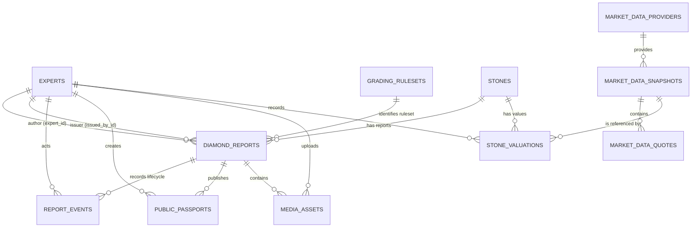

# Схема бази даних

Документ описує цільову локальну схему Diamant ID у MariaDB/XAMPP після
Alembic revision `0011_expert_work_sessions`, готову до застосування після
локальної `0010_market_reference_policy`. `0011` не містить backfill, тому
поточна локальна MariaDB лишається на `0010` до окремої команди. Це карта даних для розробки, API та
майбутньої PostgreSQL-міграції, а не інструкція з відновлення чи ручної зміни
таблиць.

Джерела істини: SQLAlchemy-моделі у `backend/models.py` і відстежувані Alembic
revisions у `alembic/versions/`. Не створюйте таблиці через `create_all` і не
редагуйте їх вручну: зміна схеми завжди потребує окремої revision.

## Логічні бази MariaDB

| База | Таблиці | Призначення |
| --- | --- | --- |
| `diamond_oltp` | `experts`, `diamond_reports`, `stones`, `report_events`, `report_work_sessions`, `report_work_session_events`, `report_work_session_leases`, `public_passports`, `grading_rulesets`, `stone_valuations`, `media_assets` | Оперативні користувачі, звіти, lifecycle, server-timed active-time, ruleset-и, revocable public passport, приватні вкладення та фінансові записи. |
| `diamond_market` | `grade_mappings`, `reference_values`, `market_price_reference`, `market_data_providers`, `market_data_snapshots`, `market_data_quotes`, `fx_data_snapshots` | Числові й текстові довідники, legacy demo-індекс та versioned дані зовнішніх провайдерів. |
| `diamond_analytics` | `ml_results` | Зарезервований аналітичний шар без чинного API або ML-потоку. |

## Контрольовані значення

MariaDB не використовує native ENUM для нового доменного контракту: коди
валідуються Pydantic/API та публікуються через `reference_values`. Це спрощує
майбутню PostgreSQL-міграцію.

| Категорія | Коди |
| --- | --- |
| Статус звіту | `draft`, `review`, `issued`, `void` |
| Походження | `unknown`, `natural`, `lab_grown`, `other` |
| Обробка | `not_assessed`, `none_detected`, `disclosed`, `confirmed` |
| Ідентифікація | `preliminary`, `confirmed`, `inconclusive` |
| Комерційний стан | `not_for_sale`, `available`, `reserved`, `sold`, `withdrawn` |
| Роль користувача | `admin`, `gemologist` |

## Зв’язки

`report_id` формату `DR-xxxxx` лишається бізнес-ідентифікатором звіту.
`stone_id` — внутрішній технічний ключ фізичного каменю. Один `Stone` може
мати кілька звітів, хоча migration backfill створила один камінь для кожного
legacy-звіту: історичних даних недостатньо, щоб безпечно об’єднувати їх.

## Моделі `diamond_oltp`

### `experts`

Користувачі системи й автори доменних дій.

| Поле | Тип | Обмеження та призначення |
| --- | --- | --- |
| `expert_id` | `INTEGER` | Первинний ключ. |
| `username` | `VARCHAR(50)` | Обов’язковий унікальний логін. |
| `password_hash` | `VARCHAR(255)` | Обов’язковий bcrypt-хеш; відкритий пароль не зберігається. |
| `role` | `ENUM` | `admin` або `gemologist`. |
| ПІБ-поля | `VARCHAR(50)?` | Необов’язкові відображувані дані. |
| `created_at` | `TIMESTAMP` | Час створення, default `CURRENT_TIMESTAMP`. |

### `stones`

Стабільні фізичні та доменні дані каменю. `stone_id` — первинний ключ;
`legacy_source_report_id` nullable і unique лише для відстежуваного backfill.

| Група | Поля | Призначення |
| --- | --- | --- |
| Ідентифікація | `shape`, `carat_weight`, `color_grade`, `clarity_grade` | Форма і 4C. |
| Геометрія | `measurements_*`, `table_percent`, `depth_percent`, `crown_angle`, `pavilion_angle` | Фактичні виміри та параметри IDC. |
| Finish | `girdle_thickness`, `culet_size`, `polish_grade`, `symmetry_grade`, `fluorescence_grade` | Додаткові характеристики каменю. |
| Походження | `origin`, `legacy_origin_code`, `treatment_status`, `identification_status`, `identification_method`, `identification_conclusion` | Походження, обробка й рівень/метод ідентифікації. |
| Комерційний стан | `market_status`, `legacy_sale_date`, `legacy_days_on_market` | Стан пропозиції без змішування з ціною. |
| Аудит | `created_at`, `updated_at` | Час створення та оновлення. |

Для legacy dataset коди `0` і `1` перенесені відповідно як `natural` і
`lab_grown`; недокументовані коди `2`/`3` збережені у `legacy_origin_code`, а
`origin` встановлено в `unknown`.

### `diamond_reports`

Конкретна версія експертного звіту. Таблиця також зберігає historical legacy
колонки; чинні dashboard, wizard і detail/edit використовують приватний
`/reports` і `stone_id`.

| Група | Поля | Призначення |
| --- | --- | --- |
| Ключі й lifecycle | `report_id`, `stone_id`, `status`, `examination_date`, `created_at`, `updated_at`, `issued_at` | Ідентифікатор, зв’язок із каменем, фактична дата дослідження та життєвий цикл `draft → review → issued → void`. |
| Авторство | `expert_id`, `issued_by_id` | Автор-експерт та admin-видавець. |
| Результати | `system_proportions_grade`, `system_cut_grade`, `calculation_rule_version` | Системний preview і immutable код ruleset. |
| Експертні grades | `expert_proportions_grade`, `expert_cut_grade`, `expert_confirmed_at`, `expert_comment` | Proportions задає експерт; `expert_cut_grade` сервер похідно обчислює з Proportions, Polish і Symmetry. |
| Legacy projection | `shape`, 4C/геометрія, `stone_origin`, `price`, `is_sold`, image-path поля тощо | Історичні дані без активного HTTP API; їхній cleanup або контрольований backfill потребують окремого погодженого рішення. |

`price` — `legacy_unclassified_value`: він не є ринковою, експертною чи
фактичною ціною та не переноситься автоматично у `stone_valuations`.

### `grading_rulesets`

Незмінні метадані підтримуваних методик: `ruleset_id` (PK), назва, первинне
джерело й редакція, effective date, версія алгоритму, scope note, active flag
і час створення. `calculation_rule_version` у report зберігає цей ідентифікатор
без перерахунку історичних grades. `legacy-unversioned-v1` лише маркує старі
невідомі правила; `idc-demo-v1` — активний обмежений ruleset MVP.

### `report_events`

Append-only журнал lifecycle. `event_id` — первинний ключ; `report_id` —
обов’язковий FK на `diamond_reports`; `actor_id` — nullable FK на `experts`.
Подія містить `action`, попередній і новий статус, необов’язкову причину та
`created_at`.

Для нового immutable ринкового орієнтиру application додає подію в тій самій
транзакції: `system_market_reference_added` для автоматичного policy-орієнтиру
або `market_reference_added` для ручного admin-підтвердження. `reason` містить
private provenance: суму, провайдера і номер market snapshot-а. Historical
valuation не отримують вигаданих подій заднім числом.

Migration `0002` створила по одній події `legacy_import` для кожного
перенесеного report і не виводила з цього факту ні видачу, ні підтвердження.

### `report_work_sessions`, `report_work_session_events`, `report_work_session_leases`

`report_work_sessions` зберігає одну завершувану server-timed сесію автора
збереженої чернетки: UUID, report/expert FK, tab identifier, start/last activity/
end, підсумок `active_seconds` та reason закриття. `report_work_session_events`
є append-only доказом `start`, `resume`, `heartbeat`, `save`, `pause` і
`finish` з накопиченим active-time. Mutable `report_work_session_leases` має
складений PK `(report_id, expert_id)` і підтримує тільки одну активну вкладку;
це технічне блокування, не історичний журнал. 60-секундний maximum interval і
75-секундний lease не дають зарахувати просто відкриту або offline-вкладку.
Revision `0011` не створює сесії для historical reports.

### `public_passports`

Revocable public projection для виданого звіту. `passport_id` — технічний
ключ; `report_id` і `created_by_id` — обов’язкові FK; `public_id` — унікальний
непослідовний token. `is_active`, `created_at` і `revoked_at` зберігають
publication state без зміни приватного report. Public API повертає дані лише
коли token активний, report має `status=issued` та непорожній `issued_at`.
Відкликання або `void` робить старе посилання непридатним. Публічні media не
підтримуються у цій revision і винесені в 130.

### `media_assets`

Метадані приватних вкладень звіту. Сам файл не зберігається у MariaDB і не
комітиться: локально він лежить під gitignored `storage/reports/<report-id>/`
або в каталозі `MEDIA_STORAGE_PATH`.

| Поля | Призначення |
| --- | --- |
| `media_id`, `report_id`, `uploaded_by_id` | Первинний ключ і обов’язкові FK на звіт та автора upload. |
| `asset_type` | `stone_photo`, `plotting_diagram`, `instrument_image` або `supporting_document`. |
| `storage_key`, `original_filename` | Згенерований сервером ключ і відображувана назва; клієнтський шлях не використовується. |
| `mime_type`, `size_bytes`, `sha256` | Перевірені сервером тип, розмір і контрольний хеш файлу. |
| `created_at`, `is_public` | Технічний час і майбутня ознака видимості; за замовчуванням `false`. |

API не монтує storage як static directory: читання проходить тільки через
авторизований endpoint owner/admin. `is_public` ще не відкриває файл — це
окреме рішення для публічного паспорта. Legacy `plotting_image` і `real_image`
не переносилися, бо містять непідтверджені placeholder-шляхи, а не файли.

### `stone_valuations`

Майбутні versioned фінансові величини каменю. `valuation_id` — первинний ключ;
`stone_id` — обов’язковий FK. `amount` має `DECIMAL(14,2)`, а не `float`.

| Поля | Призначення |
| --- | --- |
| `valuation_kind`, `amount`, `currency_code`, `unit` | Семантика й точна сума. |
| `source_name`, `source_reference`, `observed_at` | Перевірюване зовнішнє або експертне джерело та момент спостереження. |
| `market_snapshot_id`, `applicability_note` | Nullable ідентифікатор immutable OpenFacet snapshot-а. Для ручного `market_reference` note є обов’язковим підтвердженням admin; системний `system_market_reference` не має такого підтвердження. Значення snapshot не копіюються й не перераховуються. |
| `fx_snapshot_id`, `fx_rate`, `fx_rate_date`, `converted_amount`, `converted_currency_code` | Nullable frozen NBU USD/UAH projection: snapshot, Decimal rate, official rate date і обчислений UAH total. Записуються разом із новим market reference і надалі не змінюються. |
| `created_by_id`, `created_at` | Автор запису й технічний час. |

`0008` дозволяє admin створити `market_reference` лише з approved OpenFacet
snapshot-а для natural stone та після явного підтвердження застосовності.
Чинний сервіс також best-effort створює `system_market_reference` для
підтримуваного нового/оновленого draft за останнім approved snapshot-ом;
відсутність покриття або зовнішнього FX не скасовує save. Обидва записи
immutable, а ручний має display-пріоритет.
Це model-based retail benchmark, не appraisal, offer, transaction чи sale
price. Legacy `DiamondReport.price` і public passport не змінюються. Wizard
до save лише читає active policy та approved snapshot для нефіксованого preview.

## Моделі `diamond_market`

### `grade_mappings`

Числовий legacy-довідник: `id` — первинний ключ; складений unique
`(category, grade_value)` не допускає дубль категорії та оцінки. Він лишається
сумісним із чинним frontend.

### `reference_values`

Текстовий довідник нового контракту. Має `reference_id`, `category`, `code`,
`label`, `sort_order`, `is_active` і складений unique
`(category, code)`. Revision `0002` заповнила 30 значень для статусів,
походження, treatment, identification, commercial state та форм каменю.

### `market_price_reference`

Legacy demo-індекс: `id`, `price_index_value DECIMAL(10,4)`, `updated_by`,
`updated_at`, `notes`. Поточне значення не має підтверджених валюти, одиниці
чи джерела; не є ринковим котируванням і не використовується як нова фінансова
сутність.

### `market_reference_policies`

Singleton-налаштування, яке application читає за фіксованим `policy_id=1`, лише для **майбутніх** системних
орієнтирів: nullable `market_provider_code`, `use_fx_conversion`, nullable
`fx_provider_code`, `updated_by_id`, `updated_at`. Обидва provider code — FK до
`market_data_providers`; policy не посилається на конкретний snapshot, бо
server обирає останній `approved` snapshot на момент create/update draft.
Зміна policy не переписує `stone_valuations`.

### `market_data_providers`

Каталог підтримуваних зовнішніх джерел. `provider_code` — стабільний PK,
`display_name`, `provider_type`, `base_currency`, `quote_unit`, `source_url`,
`methodology_url`, `scope_note`, `is_active`, `created_at` пояснюють, що саме
провайдер публікує. Revision `0008` додає `openfacet`, а `0009` — `nbu` як
джерело official USD/UAH. Додавання іншого провайдера потребує adapter-а,
policy та окремого рішення про умови використання.

### `market_data_snapshots`

Незмінний результат одного отримання даних: `snapshot_id`, `provider_code`,
`snapshot_kind`, `status` (`candidate`, `approved`, `rejected`), base currency
та unit, source/methodology URL, scope note, кількість quotes, SHA-256
контрольного набору, retrieved timestamp, actor і decision metadata. Після
створення quotes не редагуються: admin може тільки раз затвердити або
відхилити candidate. Помилка fetch не створює snapshot і не зачіпає старі.

### `market_data_quotes`

Нормалізовані записи одного snapshot-а: `quote_id`, `snapshot_id`,
`shape_code`, `carat_anchor`, `color_code`, `clarity_code`,
`price_per_carat DECIMAL(14,2)`. Складений unique не дозволяє дубль координат
в межах snapshot-а. Для OpenFacet цілісна сума каменю обчислюється сервером з
обраного snapshot-а й ваги через явну interpolation між carat anchors;
збережена `StoneValuation.amount` не змінюється з новим snapshot-ом.

### `fx_data_snapshots`

Незмінна відповідь офіційного курсу: `fx_snapshot_id`, `provider_code=nbu`,
base `USD`, quote `UAH`, `rate DECIMAL(18,8)`, `rate_date`, URL,
`retrieved_at`, actor і `created_at`. Manual refresh лише додає запис. Під час
OpenFacet attach backend завжди бере нову відповідь НБУ; він не підставляє
старий snapshot, якщо мережа недоступна. Для best-effort системного орієнтира
відсутність НБУ лише пропускає enrichment, а не скасовує draft save.

## Модель `diamond_analytics`

### `ml_results`

Зарезервована таблиця майбутніх ML-результатів. `report_id` — первинний ключ;
далі можливі `predicted_price`, `predicted_class`, cluster/SOM-координати та
`processed_at`. Поточний seed створює таблицю порожньою; API, model artifact,
метрики й відтворюваний ML workflow ще не реалізовані.

## Міграції та локальна безпека

| Revision | Зміст |
| --- | --- |
| `0001_initial_schema` | Початкові таблиці трьох логічних баз. |
| `0002_report_core` | `Stone`, `ReportEvent`, `StoneValuation`, `reference_values`, lifecycle-колонки та backfill legacy reports. |
| `0003_media_assets` | `media_assets` для приватних файлів і метаданих; без backfill legacy image-path полів. |
| `0004_report_wizard` | `diamond_reports.examination_date` і довідники `girdle_thickness` / `culet_size` для майстра. |
| `0005_public_passports` | Revocable public tokens для issued reports; без backfill даних, цін або media. |
| `0006_expert_activation` | Оборотний active-стан експертних акаунтів без hard delete. |
| `0007_grading_rulesets` | Immutable metadata `idc-demo-v1` і legacy marker без перерахунку report grades. |
| `0008_market_data_providers` | Provider-neutral catalog, immutable OpenFacet candidate/approved/rejected snapshots і quotes; nullable snapshot provenance у `stone_valuations`. Не fetch-ить дані, не створює valuation, не переписує legacy/demo values. |
| `0009_nbu_fx_snapshots` | Додає `nbu`, immutable `fx_data_snapshots` і nullable frozen FX/UAH поля для нових `stone_valuations`. Не backfill-ить і не переоцінює historical values. |
| `0010_market_reference_policy` | Додає singleton policy вибору market/FX provider для майбутнього `system_market_reference`; seed `openfacet` + увімкнений `nbu`. Не змінює snapshots, historical valuations чи legacy demo-індекс. |
| `0011_expert_work_sessions` | Додає порожні server-timed work sessions, append-only events і single-tab leases. Не backfill-ить `evaluation_time_sec`, timestamps або старі reports. |

`alembic upgrade`, `downgrade`, `stamp` і `scripts/seed_db.py` змінюють
локальні дані або схему. Перед ними перевіряйте backup і виконуйте лише за
погодженим планом. Поточний runtime — MariaDB; майбутнє перенесення в
PostgreSQL має використовувати окремий backfill і перевірку сумісності, а не
копіювання data-directory.
