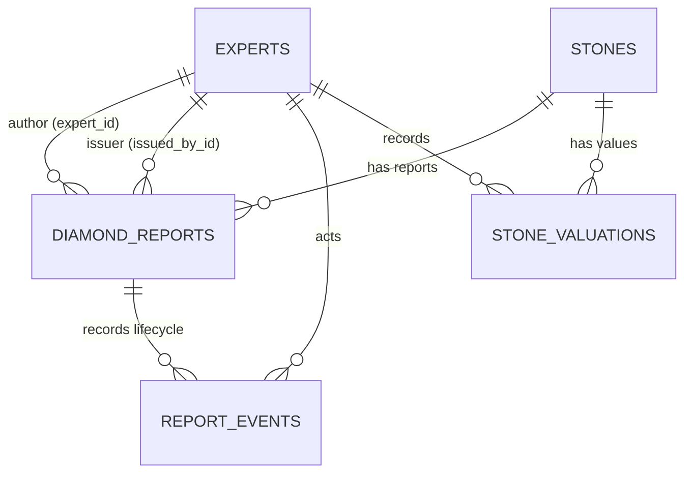

# Схема бази даних

Документ описує фактичну локальну схему Diamant ID у MariaDB/XAMPP після
Alembic revision `0002_report_core`. Це карта даних для розробки, API та
майбутньої PostgreSQL-міграції, а не інструкція з відновлення чи ручної зміни
таблиць.

Джерела істини: SQLAlchemy-моделі у `backend/models.py` і відстежувані Alembic
revisions у `alembic/versions/`. Не створюйте таблиці через `create_all` і не
редагуйте їх вручну: зміна схеми завжди потребує окремої revision.

## Логічні бази MariaDB

| База | Таблиці | Призначення |
| --- | --- | --- |
| `diamond_oltp` | `experts`, `diamond_reports`, `stones`, `report_events`, `stone_valuations` | Оперативні користувачі, звіти, фізичні камені, lifecycle та майбутні фінансові записи. |
| `diamond_market` | `grade_mappings`, `reference_values`, `market_price_reference` | Числові та текстові довідники; legacy demo-індекс ціни. |
| `diamond_analytics` | `ml_results` | Зарезервований аналітичний шар без чинного API або ML-потоку. |

## Контрольовані значення

MariaDB не використовує native ENUM для нового доменного контракту: коди
валідуються Pydantic/API та публікуються через `reference_values`. Це спрощує
майбутню PostgreSQL-міграцію.

| Категорія | Коди |
| --- | --- |
| Статус звіту | `draft`, `review`, `issued`, `void` |
| Походження | `unknown`, `natural`, `lab_grown`, `other` |
| Обробка | `not_assessed`, `none_detected`, `disclosed`, `confirmed` |
| Ідентифікація | `preliminary`, `confirmed`, `inconclusive` |
| Комерційний стан | `not_for_sale`, `available`, `reserved`, `sold`, `withdrawn` |
| Роль користувача | `admin`, `gemologist` |

## Зв’язки

`report_id` формату `DR-xxxxx` лишається бізнес-ідентифікатором звіту.
`stone_id` — внутрішній технічний ключ фізичного каменю. Один `Stone` може
мати кілька звітів, хоча migration backfill створила один камінь для кожного
legacy-звіту: історичних даних недостатньо, щоб безпечно об’єднувати їх.

## Моделі `diamond_oltp`

### `experts`

Користувачі системи й автори доменних дій.

| Поле | Тип | Обмеження та призначення |
| --- | --- | --- |
| `expert_id` | `INTEGER` | Первинний ключ. |
| `username` | `VARCHAR(50)` | Обов’язковий унікальний логін. |
| `password_hash` | `VARCHAR(255)` | Обов’язковий bcrypt-хеш; відкритий пароль не зберігається. |
| `role` | `ENUM` | `admin` або `gemologist`. |
| ПІБ-поля | `VARCHAR(50)?` | Необов’язкові відображувані дані. |
| `created_at` | `TIMESTAMP` | Час створення, default `CURRENT_TIMESTAMP`. |

### `stones`

Стабільні фізичні та доменні дані каменю. `stone_id` — первинний ключ;
`legacy_source_report_id` nullable і unique лише для відстежуваного backfill.

| Група | Поля | Призначення |
| --- | --- | --- |
| Ідентифікація | `shape`, `carat_weight`, `color_grade`, `clarity_grade` | Форма і 4C. |
| Геометрія | `measurements_*`, `table_percent`, `depth_percent`, `crown_angle`, `pavilion_angle` | Фактичні виміри та параметри IDC. |
| Finish | `girdle_thickness`, `culet_size`, `polish_grade`, `symmetry_grade`, `fluorescence_grade` | Додаткові характеристики каменю. |
| Походження | `origin`, `legacy_origin_code`, `treatment_status`, `identification_status`, `identification_method`, `identification_conclusion` | Походження, обробка й рівень/метод ідентифікації. |
| Комерційний стан | `market_status`, `legacy_sale_date`, `legacy_days_on_market` | Стан пропозиції без змішування з ціною. |
| Аудит | `created_at`, `updated_at` | Час створення та оновлення. |

Для legacy dataset коди `0` і `1` перенесені відповідно як `natural` і
`lab_grown`; недокументовані коди `2`/`3` збережені у `legacy_origin_code`, а
`origin` встановлено в `unknown`.

### `diamond_reports`

Конкретна версія експертного звіту. Таблиця тимчасово містить також legacy
колонки, бо чинний frontend ще використовує `/diamonds/*`; новий приватний
контракт використовує `/reports` і `stone_id`.

| Група | Поля | Призначення |
| --- | --- | --- |
| Ключі й lifecycle | `report_id`, `stone_id`, `status`, `created_at`, `updated_at`, `issued_at` | Ідентифікатор, зв’язок із каменем і життєвий цикл `draft → review → issued → void`. |
| Авторство | `expert_id`, `issued_by_id` | Автор-експерт та admin-видавець. |
| Результати | `system_proportions_grade`, `system_cut_grade`, `calculation_rule_version` | Розрахунок системи й версія правила. |
| Підтвердження | `expert_proportions_grade`, `expert_cut_grade`, `expert_confirmed_at`, `expert_comment` | Окремий експертний висновок; системний результат його не замінює. |
| Compatibility | `shape`, 4C/геометрія, `stone_origin`, `price`, `is_sold`, image-path поля тощо | Старий projection для `/diamonds/*`; поступово вилучатиметься лише після переходу UI. |

`price` — `legacy_unclassified_value`: він не є ринковою, експертною чи
фактичною ціною та не переноситься автоматично у `stone_valuations`.

### `report_events`

Append-only журнал lifecycle. `event_id` — первинний ключ; `report_id` —
обов’язковий FK на `diamond_reports`; `actor_id` — nullable FK на `experts`.
Подія містить `action`, попередній і новий статус, необов’язкову причину та
`created_at`.

Migration `0002` створила по одній події `legacy_import` для кожного
перенесеного report і не виводила з цього факту ні видачу, ні підтвердження.

### `stone_valuations`

Майбутні versioned фінансові величини каменю. `valuation_id` — первинний ключ;
`stone_id` — обов’язковий FK. `amount` має `DECIMAL(14,2)`, а не `float`.

| Поля | Призначення |
| --- | --- |
| `valuation_kind`, `amount`, `currency_code`, `unit` | Семантика й точна сума. |
| `source_name`, `source_reference`, `observed_at` | Перевірюване зовнішнє або експертне джерело та момент спостереження. |
| `created_by_id`, `created_at` | Автор запису й технічний час. |

Таблиця порожня після `0002`: авторитетний market provider, scheduler, ML і
ручний admin flow — майбутні окремі задачі за [ADR-002](./decisions/002-financial-calculation-contract.md).

## Моделі `diamond_market`

### `grade_mappings`

Числовий legacy-довідник: `id` — первинний ключ; складений unique
`(category, grade_value)` не допускає дубль категорії та оцінки. Він лишається
сумісним із чинним frontend.

### `reference_values`

Текстовий довідник нового контракту. Має `reference_id`, `category`, `code`,
`label`, `sort_order`, `is_active` і складений unique
`(category, code)`. Revision `0002` заповнила 30 значень для статусів,
походження, treatment, identification, commercial state та форм каменю.

### `market_price_reference`

Legacy demo-індекс: `id`, `price_index_value DECIMAL(10,4)`, `updated_by`,
`updated_at`, `notes`. Поточне значення не має підтверджених валюти, одиниці
чи джерела; не є ринковим котируванням і не використовується як нова фінансова
сутність.

## Модель `diamond_analytics`

### `ml_results`

Зарезервована таблиця майбутніх ML-результатів. `report_id` — первинний ключ;
далі можливі `predicted_price`, `predicted_class`, cluster/SOM-координати та
`processed_at`. Поточний seed створює таблицю порожньою; API, model artifact,
метрики й відтворюваний ML workflow ще не реалізовані.

## Міграції та локальна безпека

| Revision | Зміст |
| --- | --- |
| `0001_initial_schema` | Початкові таблиці трьох логічних баз. |
| `0002_report_core` | `Stone`, `ReportEvent`, `StoneValuation`, `reference_values`, lifecycle-колонки та backfill legacy reports. |

`alembic upgrade`, `downgrade`, `stamp` і `scripts/seed_db.py` змінюють
локальні дані або схему. Перед ними перевіряйте backup і виконуйте лише за
погодженим планом. Поточний runtime — MariaDB; майбутнє перенесення в
PostgreSQL має використовувати окремий backfill і перевірку сумісності, а не
копіювання data-directory.
