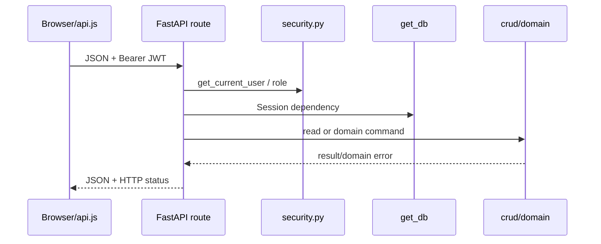

# Backend і API: практичний маршрут запиту

FastAPI entry point — `backend/main.py`. Route приймає Pydantic payload, отримує SQLAlchemy session через dependency, перевіряє JWT/current user і лише тоді викликає domain CRUD.



## Орієнтир у файлах

| Файл | Відповідальність |
| --- | --- |
| `main.py` | routes, HTTP status, dependencies, CORS |
| `schemas.py` | Pydantic request/response contract |
| `security.py` | password hash, JWT, current user |
| `crud.py` | queries, lifecycle/domain persistence |
| `models.py` | SQLAlchemy schema mapping |
| `calculator.py` | deterministic IDC rules, не ML |

## Мінімальний protected endpoint

```python
@app.get("/statistics/expert-performance", response_model=List[schemas.ExpertStats])
def get_stats(db: Session = Depends(get_db),
              current_user: models.Expert = Depends(get_current_user)):
    require_admin(current_user)
    return crud.get_expert_stats(db)
```

Browser не є джерелом прав: `get_current_user` перевіряє Bearer JWT, а `require_admin` — роль на сервері. Неправильний input повертається як `422`, відсутній record — `404`; lifecycle/lease conflicts — `409`.

## Транзакція і domain error

```python
result = crud.record_work_session_signal(db, report=report, actor=current_user, signal=payload)
db.commit()
return result
```

За domain або integrity error маршрут робить `db.rollback()`. CRUD не обходить RBAC, а route не містить SQL.

## Межі API

- `/reports*` — лише operational reports; owner/admin і lifecycle.
- `/demo/datasets/*` — manifest-authorized synthetic data; admin без personal opt-in отримує opaque `404`.
- `/market-data/*` — admin-only immutable snapshots; save report не fetch-ить provider.
- `/public/passports/{public_id}` — окрема allow-listed anonymous projection.

OpenAPI: `/docs` і `/openapi.json`. Read-only contract smoke: `scripts/audit-api.mjs`. Повний перелік — [architecture](../architecture.md), workflow — [current domain guide](./current-domain-and-report-workflow.md).

## Правило для нового endpoint-а

Спочатку Pydantic schema і domain operation, потім route з явним `response_model`, dependency та RBAC. Усі write paths мають commit/rollback; external provider fetch не запускається з report save. Додайте API test на дозволену роль і хоча б один denial/validation case.
