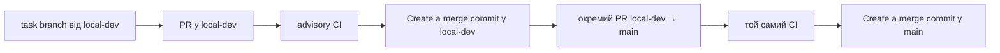

# GitHub Actions CI

## Призначення та межі

Workflow `.github/workflows/ci.yml` відтворює quality gates Diamant ID на
чистому Linux runner. Це **CI**, не deployment pipeline: він не має GitHub
secrets, provider keys, доступу до `.env`, локальної XAMPP MariaDB, production
database або зовнішніх market provider-ів.

Поки що workflow має advisory-режим. Він запускається тільки для pull request
до `local-dev` або `main`, а також вручну через **Actions → Continuous
integration → Run workflow**. Push у short-lived task-гілку не витрачає
minutes. `concurrency` скасовує застарілий run того самого PR після нового
commit.

## Гілки та merge flow



Не використовуйте squash або rebase merge для цього flow: project history
зберігає явний merge commit. До моменту переходу на PostgreSQL/staging
`main` не є deploy workflow і не отримує жодних runtime secrets.

## Jobs

| Job | Що перевіряє | Дані та ізоляція |
| --- | --- | --- |
| `Backend tests` | `compileall`, повний `pytest` | pytest SQLite fixtures, без MariaDB |
| `MariaDB schema check` | bootstrap трьох logical databases, `alembic upgrade head`, `alembic check` | одноразовий GitHub service `mariadb:11.8` |
| `Frontend build and tests` | Gulp build, Node/jsdom tests | npm cache, без API |
| `Playwright mock smoke` | browser flow з mock HTTP | temporary BrowserSync |
| `Playwright real isolated flow` | login → wizard → review → passport/PDF | disposable SQLite, окремі E2E users/storage |
| `Documentation links` | Markdown link checker | repository files only |

Playwright artifacts завантажуються лише при падінні job і зберігаються три
дні. Успішні runs не створюють artifacts.

## Локальні еквіваленти

```powershell
.\.venv\Scripts\python.exe -m pytest
.\.venv\Scripts\python.exe scripts\bootstrap_mariadb_databases.py
.\.venv\Scripts\python.exe -m alembic -c alembic.ini upgrade head
.\.venv\Scripts\python.exe -m alembic -c alembic.ini check
cmd /c "cd frontend && npm test"
cmd /c "cd frontend && npm run test:e2e"
cmd /c "cd frontend && npm run test:e2e:real"
.\.venv\Scripts\python.exe scripts\check_doc_links.py
```

Real E2E runner обирає `PYTHON_EXECUTABLE`, якщо змінну задано. Це дозволяє
GitHub Linux runner використати `python`, а локальному Windows flow — існуючий
`.venv\Scripts\python.exe` без зміни сценарію.

## Налаштування repository Actions

Для поточного workflow у **Settings → Actions → General** потрібні такі межі:

- обрати **Allow OlegBon, and select non-OlegBon, actions and reusable workflows**;
- увімкнути **Allow actions created by GitHub**: CI використовує тільки
  `actions/checkout`, `actions/setup-python`, `actions/setup-node` і
  `actions/upload-artifact`;
- залишити увімкненим **Require actions to be pinned to a full-length commit
  SHA**. Усі `uses:` у workflow вже зафіксовані повними SHA;
- `Workflow permissions` лишаються **Read repository contents and packages**.

Не додавайте official `actions/*` до поля allow-list вручну: це поле призначене
для окремих pattern-ів, які GitHub розділяє комою, і зайвий custom список тут не
потрібен. Після зміни policy створюйте новий **Run workflow** для `local-dev`,
а не повторюйте run, що вже отримав startup failure.

## Після перших п'яти зелених runs

Власник репозиторію має надіслати:

1. Посилання або скрін списку п'яти workflow runs з їхньою тривалістю.
2. Скрін **Settings → Billing and plans → Usage** (лише підсумок GitHub
   Actions minutes/storage; не надсилайте tokens, secrets чи billing details).
3. Підтвердження, чи всі шість job names стабільно зелені.

Після цього можна окремо погодити в GitHub:

- budget alerts на 90 % і 100 %;
- spending limit, якщо він доступний для поточного плану;
- branch protection для `local-dev` і `main` з required checks:
  `Backend tests`, `MariaDB schema check`, `Frontend build and tests`,
  `Playwright mock smoke`, `Playwright real isolated flow`,
  `Documentation links`.

Налаштування branch protection не виконується цим кодом і потребує окремого
підтвердження власника репозиторію.
