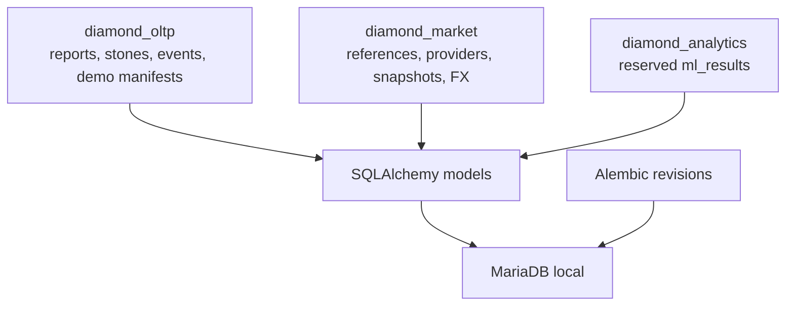

# Database: моделі, схеми й безпечні зміни

Локальний MariaDB має три databases: `diamond_oltp`, `diamond_market`, `diamond_analytics`. Майбутній PostgreSQL/cloud контур ще не runtime-факт.



## Що де зберігається

| Schema | Поточна роль | Чого там немає |
| --- | --- | --- |
| `diamond_oltp` | accounts, operational reports, events, media metadata, synthetic manifests/SOM artifact | public static media serving |
| `diamond_market` | reference values, provider snapshots, FX, market policy | expert valuation або ML training data |
| `diamond_analytics` | reserved `ml_results` | реалізованого ML API чи demo SOM |

## Модель явно задає schema

```python
class Expert(Base):
    __tablename__ = "experts"
    __table_args__ = {"schema": "diamond_oltp"}
    expert_id = Column(Integer, primary_key=True)
    demo_access_enabled = Column(Boolean, nullable=False, default=False)
```

`database.py` завжди закриває dependency session:

```python
def get_db():
    db = SessionLocal()
    try: yield db
    finally: db.close()
```

`DiamondReport.record_scope` і `demo_dataset_id` мають DB constraints: demo-ізоляція визначається scope/manifest, а не префіксом ID.

## Alembic lifecycle

```powershell
.\.venv\Scripts\python.exe -m alembic -c alembic.ini upgrade head --sql
# після backup і окремого підтвердження:
.\.venv\Scripts\python.exe -m alembic -c alembic.ini upgrade head
```

Наприклад `0020_demo_provider_analytics_eligibility` змінює лише synthetic manifests через `UPDATE diamond_oltp.demo_datasets ... WHERE provenance LIKE 'synthetic-demo-v%'`. Міграція не повинна переписувати historical reports, valuations чи events. `seed_db.py` руйнівно перестворює всі три local databases.

Карта таблиць: [db schema](../db-schema.md). Повний topology/configuration contract: [database topology](./database-topology.md). Backup/recovery: [local start](../local-start.md), [MariaDB recovery](./mariadb-local-recovery.md).

## Перед зміною даних

1. Прочитати existing revision і models; нова migration має бути вузькою та reversible лише там, де це безпечно.
2. Згенерувати SQL через `upgrade head --sql`, зробити backup, і лише після явного підтвердження виконувати upgrade.
3. Не використовувати `seed_db.py` як спосіб «підправити» дані: це reset local runtime.
4. Після schema change — `alembic current`, `alembic check` і targeted test у SQLite, пам'ятаючи про різницю MariaDB/PostgreSQL dialect.
