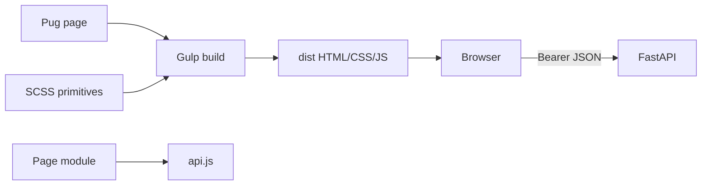

# Frontend: як працює клієнт

Frontend — статичний Pug/SCSS/vanilla JavaScript застосунок. Редагуються лише `frontend/src/**`; `frontend/dist/**` є результатом Gulp-збірки.

## Орієнтир у файлах

```text
frontend/src/
├─ pug/layout/main.pug       # shell, header, footer
├─ pug/pages/*.pug           # HTML конкретного екрана
├─ scss/_variables.scss      # кольори, spacing, control metrics
├─ scss/_ui-primitives.scss  # спільні controls, surfaces, tabs, dialogs
└─ js/
   ├─ main.js                # bootstrap і guard protected pages
   └─ modules/{api,auth,...}.js # API та page-specific поведінка
```



## Потік сторінки

`src/pug/pages/*.pug` дає семантичний HTML, `src/scss/main.scss` підключає дизайн і `_ui-primitives.scss`, а `src/js/main.js` після перевірки сесії підключає page module. Сторінки з `data-protected-page` спершу викликають `/users/me`: підтверджений `401` очищає локальну сесію, але network/timeout/`5xx` не робить logout.

## Єдиний API-клієнт

Усі JSON-виклики проходять через `src/js/modules/api.js`:

```js
const headers = { Accept: "application/json" };
if (token) headers.Authorization = `Bearer ${token}`;
if (body !== undefined) headers["Content-Type"] = "application/json";
const response = await fetch(`${BASE_URL}${path}`, { method, headers,
  body: body === undefined ? undefined : JSON.stringify(body) });
if (!response.ok) throw new ApiRequestError(payload?.detail, response.status);
```

Сторінковий модуль не формує `fetch` самостійно: він викликає експорт API-клієнта, показує `aria-live` status і оновлює DOM через безпечні DOM API. Це дає один формат authorization та помилок для dashboard, wizard, profile, analytics і demo.

## UI-примітиви

`_variables.scss` містить spacing scale і normal/compact control heights. `_ui-primitives.scss` — джерело істини для flat surfaces, 2px controls, tabs, dialogs, tables і `.form-actions`:

```scss
.form-actions { display: flex; flex-wrap: wrap;
  gap: variables.$space-3; margin-top: variables.$space-4; }
```

На вузькому екрані кнопки `.form-actions` стають на всю ширину. Нові екрани мають перевикористовувати цей клас, а не додавати page-specific відступ до submit button.

## Команди й межі

```powershell
cmd /c "cd frontend && npm run build"
cmd /c "cd frontend && npm start"
cmd /c "cd frontend && npm test"
```

BrowserSync віддає `dist`, а не API. Деталі shell, UX-правил і тестів: [local start](../local-start.md), [product UX](./product-ux-foundation.md), [testing guide](./testing-guide.md). Архітектурні межі — в [architecture](../architecture.md).

## Як безпечно змінити екран

1. Знайти сторінку в `pug/pages` і її module через `data-...-page` у markup.
2. Для server data додати функцію в `modules/api.js`, не новий локальний `fetch`.
3. Використати `.form-actions`, `.account-surface`, tabs/table primitives і spacing tokens; не правити `dist`.
4. Запустити build, module/DOM tests і, коли є interaction, Playwright. Новий UI не є дозволом змінювати API/RBAC.
