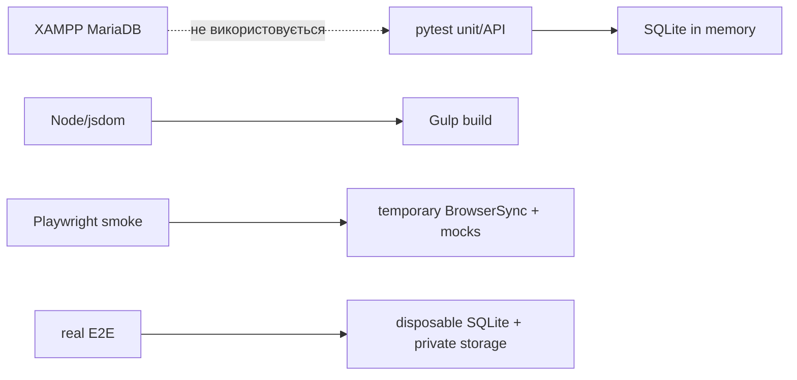

# Testing: що перевіряє кожен контур

Тести ізольовані від робочої XAMPP MariaDB.

| Контур | Команда | Дані / призначення |
| --- | --- | --- |
| Python unit/API | `.\.venv\Scripts\python.exe -m pytest` | SQLite in-memory зі schema translation; domain, RBAC і HTTP contracts. |
| Frontend modules/DOM | `cmd /c "cd frontend && npm test"` | build + Node test/jsdom. |
| Browser smoke | `cmd /c "cd frontend && npm run test:e2e"` | тимчасовий BrowserSync і mock HTTP. |
| Real isolated flow | `cmd /c "cd frontend && npm run test:e2e:real"` | disposable SQLite: login → wizard → review → passport/PDF. |

API/integration fixture не читає `.env` або MariaDB: schema translation направляє logical schemas у SQLite test runtime. Отже test може перевірити `401/403/404/422`, не змінюючи local reports.

Для коду: targeted pytest/import smoke; для Pug/SCSS/JS: build + `npm test`; для interaction: Playwright. Завжди виконуй `git diff --check` і `python scripts/check_doc_links.py`. Browser binaries: `cmd /c "cd frontend && npx playwright install chromium chromium-headless-shell"`.

## Вибір перевірки

- Змінили domain/API contract — pytest API + negative RBAC case.
- Змінили page module — `npm test`; лише markup/style — принаймні build.
- Змінили responsive interaction, dialog, navigation або form submit — `npm run test:e2e` і ручний visual smoke за можливості.
- Не підміняйте тестовим запуском реальні дані: `test:e2e:real` означає isolated disposable runtime, не XAMPP.
